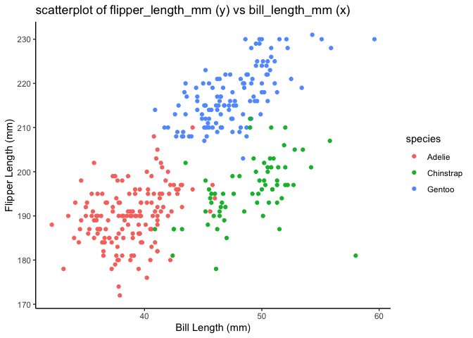

p8105_hw1_zl3544
================
2024-09-19

This is my(ZL3544, ZHAOKUNLIN) solution for P8105 hw1

Load the tidyverse function for hw1

``` r
library(tidyverse)
```

# Problem 1

The problem focus on writing a short description of the penguins dataset
which include:

- The data in this dataset, including names / values of important
  variables

- The size of the dataset

- The mean flipper length

- Make a scatterplot

Load the penguins dataset from the palmerpenguins package:

``` r
data("penguins", package = "palmerpenguins")
```

## Names of the dataset

The names of the data in penguins dataset is showed using the following
code:

``` r
ls(penguins)
## [1] "bill_depth_mm"     "bill_length_mm"    "body_mass_g"      
## [4] "flipper_length_mm" "island"            "sex"              
## [7] "species"           "year"
```

It shows that the names in the penguins dataset are: bill_depth_mm,
bill_length_mm, body_mass_g, flipper_length_mm, island, sex, species,
year

## Values of important variables in the dataset

- **Bill depth(mm)**
  - Type: numeric
  - Range: \[13.1, 21.5\]
- **Vill length(mm)**
  - Tpye: numeric
  - Range: \[32.1, 59.6\]
- **Body_mass(g)**
  - Tpye: integer
  - Range: \[2700, 6300\]
- **Flipper length(mm)**
  - Tpye: integer
  - Range: \[172, 231\]
- **Island**
  - Tpye: factor
  - Unique values: Torgersen, Biscoe, Dream
- **Sex**
  - Tpye: factor
  - Unique values: male, female, NA
- **Species**
  - Tpye: factor
  - Unique values: Adelie, Gentoo, Chinstrap
- **Year**
  - Tpye: integer
  - Data is from the year of: 2007, 2008, 2009

## The size of the dataset

The size of the dataset is 344 rows and 8 columns

## The mean flipper length

The mean flipper length is 200.9152047

## Making scatterplot

Use this code to make a scatterplot of flipper_length_mm (y) vs
bill_length_mm (x), and different species use the different color:

``` r
#make a scatterplot
scatterplot = ggplot(penguins, aes(x = bill_length_mm, y = flipper_length_mm, color = species)) +
  geom_point(na.rm = TRUE) +
  labs(
    title = "scatterplot of flipper_length_mm (y) vs bill_length_mm (x)",
    x = "Bill Length (mm)",
    y = "Flipper Length (mm)"
  ) +
  theme_classic()
print(scatterplot)
```

<!-- -->

``` r
# save the scatterplot
ggsave(filename = "scatterplot_flipper_vs_bill.png", plot = scatterplot, width = 6, height = 6)
```

# Problem 2

This problem focus on create a data frame comprised of:

- A random sample of size 10 from a standard Normal distribution

- A logical vector indicating whether elements of the sample are greater
  than 0

- A character vector of length 10

- A factor vector of length 10, with 3 different factor “levels”

And try to take the mean of each variable in the dataframe.

## Create data frame

### First, create four variables describes in the problem 2:

Create a random sample:

``` r
random_samp = rnorm(10)
```

Create a logical vector:

``` r
logical_vec = random_samp > 0
```

Create a character vector of length 10:

``` r
char_vec = sample(c("1","2","3"), size=10, replace = TRUE)
```

Create a factor vector:

``` r
factor_vec = factor(sample(c("Level1", "Level2", "Level3"), size = 10, replace = TRUE))
```

### Then put these vector into the dataframe:

``` r
hw1_df=
  tibble(
    random_samp=random_samp,
    logical_vec=logical_vec,
    char_vec=char_vec,
    factor_vec=factor_vec
  )
```

## Take mean of each variable

Next, try to take the mean of each variable of the dataframe(hw1_df)
using pull function in the vidyverse package:

``` r
mean(pull(hw1_df, random_samp))
```

    ## [1] -0.0387884

``` r
mean(pull(hw1_df, logical_vec))
```

    ## [1] 0.5

``` r
mean(pull(hw1_df, char_vec))
```

    ## Warning in mean.default(pull(hw1_df, char_vec)): argument is not numeric or
    ## logical: returning NA

    ## [1] NA

``` r
mean(pull(hw1_df, factor_vec))
```

    ## Warning in mean.default(pull(hw1_df, factor_vec)): argument is not numeric or
    ## logical: returning NA

    ## [1] NA

The result shows that we can take the mean of a numeric variable and
logical variable, but can’t take the mean of character and factor
variables.

Then, use as.numeric function to character, and factor variables, in
order to try to convert them to numeric variable.

``` r
char_vec_numeric=as.numeric(pull(hw1_df, char_vec))
factor_vec_numeric=as.numeric(pull(hw1_df, factor_vec))
```

Try to caclulate the mean of the converted variable:

``` r
mean_char_vec=mean(char_vec_numeric)
mean_factor_vec=mean(factor_vec_numeric)
```

    ## The mean of the char_vect is 2.1

    ## The mean of the factor_vec is 1.6

The reason behind this may because I use number1,2,3 to create the
char_vec, so after converted, it can be caculated, and the factor vector
can be converted into numeric factor using this the as.numeric function.
